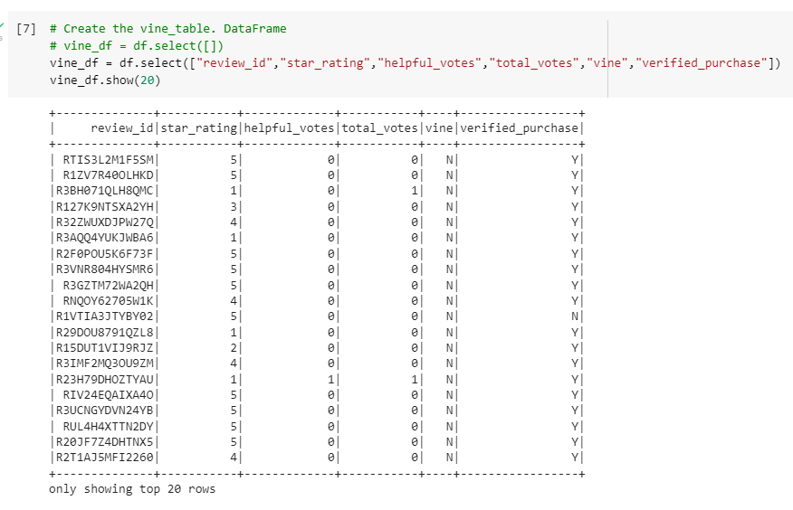

# Amazon Vine Analysis

## Purpose
Data analysis of written reviews was conducted using the ETL process to extract, transform, and load the data into pgAdmin. Google Colab, Amazon Web Services, pgAdmin, and PySpark (Spark Files) were used to conduct the data.

## Results
Reviews for video games was the dataset used.

Based on the table below the top 20 rows indicate there are only non-Vine reviews. 

Of all non-Vine reviews, 9 out of 20 reviews were 5-stars.

45% of non-Vine reviews were 5-stars.

## Summary
Based on the data, there is no positivity bias for reviews in the Vine program. None of the reviews were written by members of the paid Vine program.
